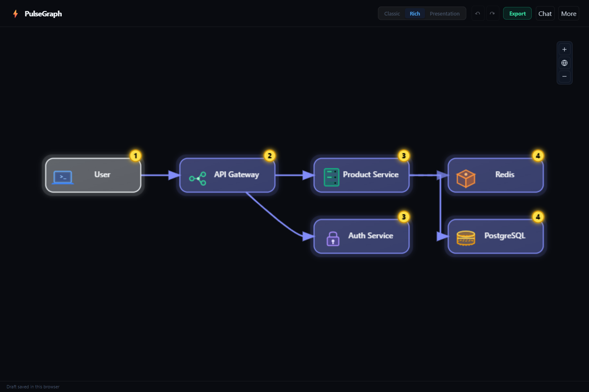

# ⚡ PulseGraph

**Turn an idea or Mermaid flowchart into a lively, editable diagram.**

PulseGraph is a browser-based workspace built with React, TypeScript, Dagre and
GSAP. Use it to explain architecture, request flows, decisions, and delivery pipelines.

Start with an example or paste Mermaid—no account or API key required.
Connect DeepSeek or local Ollama when you want to describe changes in plain English.

## Features

- Responsive landing page with an animated flow preview, working examples, and light/dark themes.
- Classic and Rich SVG diagrams with animated flow markers and icons.
- Direct Mermaid editing, mouse/touch pan, keyboard zoom, and Play/Pause.
- Local draft recovery, 20-step undo/redo, source import, editable JSON import/export.
- AI generation and refinement with cancellable requests and validated responses.
- Presentation assigns semantic roles, adapts labels and geometry to the flow, and
  retains every original node, label and edge.
- PNG, GIF, SVG, Mermaid, editable JSON, and presentation Slide PNG exports.

## Run locally

Use **Node.js 24** and npm. A .nvmrc file is included.

    npm ci
    npm run dev

Open the URL printed by Vite and click **Request flow**, or paste:

    flowchart LR
      U((User)) --> API[API Gateway]
      API --> AUTH[Auth Service]
      API --> S[Product Service]
      S --> DB[(PostgreSQL)]
      S -.-> CACHE[/Redis/]

Use **Tools → Edit Mermaid source** to change the diagram. Invalid input preserves
your current diagram. **Tools → Reset workspace** clears the saved draft and starts
fresh. In chat, Ctrl/⌘ + Enter sends; Enter inserts a new line.

## Optional AI

**DeepSeek:** Open **AI settings** on the landing page (or **Tools → AI settings**
in the workspace), choose DeepSeek, and enter your
[API key](https://platform.deepseek.com/api_keys). Requests go directly to DeepSeek.
The integration uses `deepseek-flash` with thinking disabled for interactive diagram requests.
The key stays in memory until reload; it is never written to localStorage,
the project, or exported documents.

**Ollama:** Run a local model at localhost:11434, choose Ollama in settings,
and enter the installed model name (for example gemma3:4b). Allow only the
application origins you use:

    # macOS/Linux: manually started server
    OLLAMA_ORIGINS="http://localhost:5173,http://127.0.0.1:5173" ollama serve

    # PowerShell: manually started server
    $env:OLLAMA_ORIGINS="http://localhost:5173,http://127.0.0.1:5173"
    ollama serve

For an existing Ollama application/service, configure its environment and restart
it instead of starting a second server. Match the origins to Vite's actual URL.
For local-only processing, disable Ollama cloud features with OLLAMA_NO_CLOUD=1
and choose a local model. See the [official FAQ](https://docs.ollama.com/faq).

Cloud requests time out after 60 seconds; local requests after 180 seconds.
**Cancel** stops a request. No automatic retries incur extra charges.
Model mistakes remain possible; inspect the output and use Undo when needed.

## Presentation and exports

1. Generate or import a diagram.
2. Choose **Presentation** to assign entry, pipeline, service and output roles.
3. Choose **Export → Slide PNG** for a light presentation design.

Presentation arranges nodes into semantic zones, wraps long stage sequences into
compact rows, and routes branches and retries around the cards. Titles and zones adapt to request, delivery, decision, and general process
flows instead of assuming every diagram is client/backend architecture. Slide PNG
remains disabled until roles exist. Source edits clear the roles; choose Presentation
again for the new diagram.

| Format            | Output                                                       |
| ----------------- | ------------------------------------------------------------ |
| PNG               | Settled diagram, up to 2,560 px on the long edge             |
| GIF               | Three-second moving-flow-marker loop, 15 fps, up to 2,560 px |
| Slide PNG         | Separate light-theme renderer; same frame-size choices       |
| SVG               | Settled vector diagram                                       |
| Mermaid source    | Portable .mmd source                                         |
| Editable document | Versioned JSON with source and presentation roles            |

Raster frames: content fit, 16:9, 16:10, 4:3, square, A4 landscape and portrait.
GIF encoding runs in a worker, one transferred frame at a time. Exports use an
isolated snapshot and never seek the live GSAP timeline. GIFs animate flow
markers; they do not reproduce every live icon animation.

## Supported Mermaid subset

PulseGraph uses its own flowchart parser, **not the complete Mermaid language**.

Supported: LR/RL/TB/TD/BT directions, chains, multi-node ampersand shorthand,
quoted labels, semicolon-separated statements, pipe/inline edge labels, dashed,
thick, open, cross and circle edges, and nested subgraphs.
Use ` ` inside a label for a line break.

| Shape                       | Node treatment |
| --------------------------- | -------------- |
| A((User))                   | User           |
| A(Client)                   | Client         |
| A[Service]                  | Service        |
| A[(Database)]               | Database       |
| A[/Cache/]                  | Cache          |
| A>Queue]                    | Queue          |
| A{Decision} or A{{Gateway}} | Gateway        |
| A[[Balancer]]               | Load balancer  |

Rich mode also chooses icons from names such as Redis, Auth, Stripe and LLM.
Sequence/class diagrams, click actions, custom CSS/classes, subgraph direction
overrides and unsupported directives are rejected with an explanation. Inline class
suffixes are ignored; bidirectional arrows are not supported.

Limits: 30,000 source characters, 100 nodes, 300 edges and 100 KB imported
documents. Dense graphs can remain hard to read; split them into smaller views.
Presentation labels may be shortened to fit cards; original labels stay in the
source and editable document.

## Privacy and security

Local Mermaid editing and exports make no external font, analytics or telemetry
requests. Ollama traffic goes to localhost, but cloud-hosted Ollama models can
themselves use the network. DeepSeek receives your description, current diagram
and recent chat context when you use cloud AI.

Draft source and roles are stored in this browser's localStorage; chat is
session-only. Avoid shared browser profiles for confidential drafts. Clearing
site data removes drafts and preferences. Export an editable document for backup.

Model-authored CSS is not executed. Responses, roles and source are validated
before updating the document. Production builds include a Content Security Policy.
Deployment servers should additionally set frame-ancestors in a CSP response
header. See [SECURITY.md](SECURITY.md).

## Development

    npm run format
    npm run verify
    npx playwright install chromium
    npm run test:e2e
    npm audit
    npm run preview

To test the production build and its security policy in PowerShell:

    $env:PLAYWRIGHT_PRODUCTION="1"
    npm run test:e2e

If the browser download is unavailable, use installed Chrome locally:

    # PowerShell
    $env:PLAYWRIGHT_CHANNEL="chrome"
    npm run test:e2e

CI uses Node 24, a clean install, formatting, lint, strict TypeScript/build,
unit tests, dependency audit, and Chromium end-to-end tests. Automated provider
tests are mocked and never require a real key; live providers need a separate
smoke test.

Regressions cover parsing, malformed AI output, graph preservation, document
round trips, framing limits, cycles, self-loops and a 100-graph routing corpus.
Browser tests cover editing, recovery, real exports, cancellation, mobile layout
and reduced motion.

### Local architecture graph

Contributors can build a local, queryable code map with
[Graphify](https://github.com/Graphify-Labs/graphify):

    uv tool install graphifyy
    graphify update .
    graphify query "How does diagram input reach the renderers?"

The generated `graphify-out/` directory is intentionally ignored. Refresh it after
code changes; the code-only update is local and does not require an API key.

## Structure

    src/
      App.tsx                   Workspace orchestration
      components/               Chat, settings, editor, Classic and Rich canvases
      parser/                   Parsing, Dagre and semantic role layouts
      render/blueprintSvg.ts     Static presentation renderer
      services/
        llmService.ts           AI workflows
        llmClient.ts            Bounded, cancellable provider transport
        llmValidation.ts        Runtime validation
        llmPrompts.ts           Model instructions
        gifExporter.ts          Snapshot/raster export
        gif.worker.ts           Background GIF encoding
        exportGeometry.ts       Shared frame geometry
      lib/                      Documents, roles, routing and viewport utilities
    tests/                      Unit regressions and Playwright workflows

[Contributing](CONTRIBUTING.md) · [Security](SECURITY.md) · [MIT License](LICENSE)
